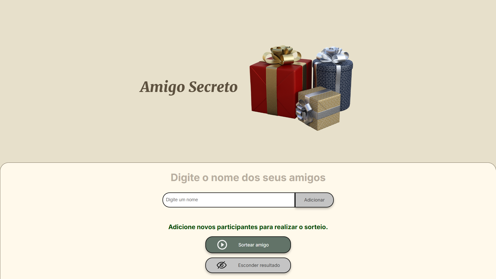
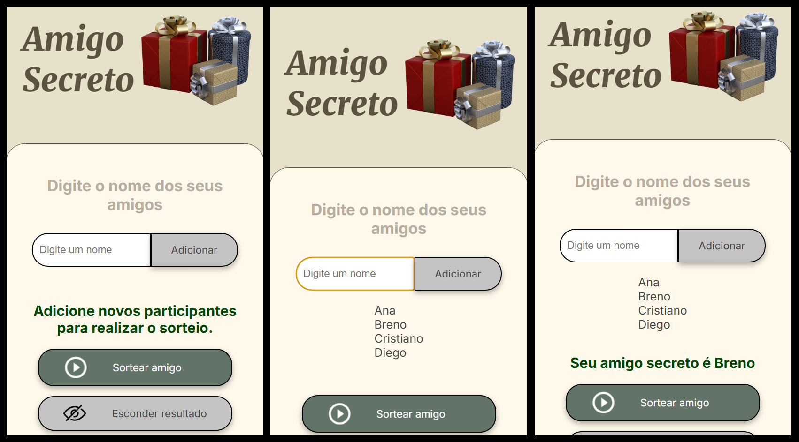

# Amigo Secreto

*Challenge Oracle Next Education - G8*

*A implementação desse projeto faz parte do Challenge da Turma G8 do Programa Oracle Next Education da [Oracle](https://www.oracle.com/) em parceria com a [Alura Latan](https://www.aluracursos.com/) e tem como intuito colocar em prática conceitos fundamentais de lógica de programação, como variáveis, condicionais, funções, listas e loops de repetição.*

---

**Objetivo**

- Desenvolver uma aplicação que permita aos usuários inserir nomes de amigos em uma lista para, em seguida, realizar um sorteio aleatório e determinar quem é o "amigo secreto".

- O usuário deverá adicionar nomes por meio de um campo de texto e de um botão "Adicionar".

- Os nomes inseridos serão exibidos em uma lista visível na página, e ao finalizar, um botão "Sortear Amigo" selecionará um dos nomes de forma aleatória, exibindo o resultado na tela.

---

**Tecnologias Utlizadas**

- **HTML** - https://www.w3schools.com/html/

- **CSS** - https://www.w3schools.com/css/
  - `media query` - https://developer.mozilla.org/en-US/docs/Web/CSS/CSS_media_queries

- **JavaScript** - https://developer.mozilla.org/en-US/docs/Web/JavaScript

---

**Funcionalidades**

- *Adicionar nomes*

Os usuários escreverão o nome de um amigo em um campo de texto e o adicionarão a uma lista visível ao clicar em `Adicionar`.

- *Validar entrada*

Se o campo de texto estiver vazio, o programa exibirá um alerta solicitando um nome válido.

- *Visualizar a lista*

Os nomes inseridos aparecerão em uma lista abaixo do campo de entrada.

- *Sorteio aleatório*

Ao clicar no botão `Sortear amigo`, um nome da lista será selecionado aleatoriamente e exibido na página.

- *Esconder resultado*

Ao clicar no botão `Esconder resultado`, o nome recém sorteado é escondido para que possa ser realizado o sorteio do próximo participante.

---

### Screenshots

**Interface Desktop**

---

**Interface Mobile**

---
